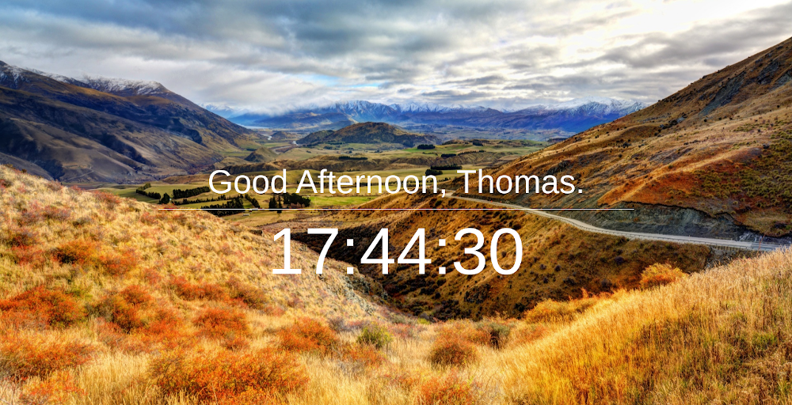

leanbro
=======

the leanest browser startpage. it's not an ass - it's your bro.

## Motivation

Existing browser startpage extensions are just nuts with all their advertising, registration and offerings. I need a very lean browser startpage which only provides the most useful information and don't try to imitate features the browser already offers. What is most important is that the extension does not try to break my flow when working inside my browser. The presented information need to be recognizable and memorizable within a few seconds so I don't reside on the startpage. Also a nice background image to sparkle creativity and induce a feeling of calm.

leanbro does not disturb you. It supports you with reaching and staying in [the zone](https://en.wikipedia.org/wiki/Flow_(psychology)).

## Preview

## Features

* Display a custom background image
* Salutation with custom name
* Live Clock with 12h/24h format

## Purge Config

When you experience problems with the extension (especially after an update), you can reset it with the **Purge Config** button on the options page. This will ensure a clean restore of the extension. You will lose your configured values in this process so make sure you want this.

## Build

Run `make package KEY_LOCATIO=/path/to/extension/key.pem` to create the initial extension.

If you want to update the extension, increase the version number in the (manifest)[manifest.json] and run the package command.

> Note: Currently the command line build feature of google-chrome is not working under Linux. In this case use the browser extension page to package the extension.

## Install

Drag and drop the *.crx file onto the extension page of your chrome browser and follow the instructions. After installing it, you can configure it via the extension popup symbol.

## Support Me

If you want to support my work, you can [buy me a beer](https://www.buymeacoffee.com/chronicc).
## License

[CC0 1.0 (Public Domain)](LICENSE.md)
